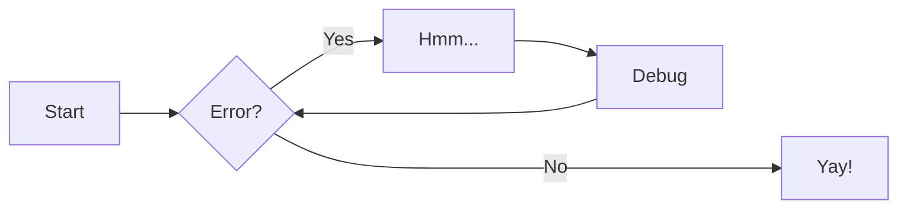
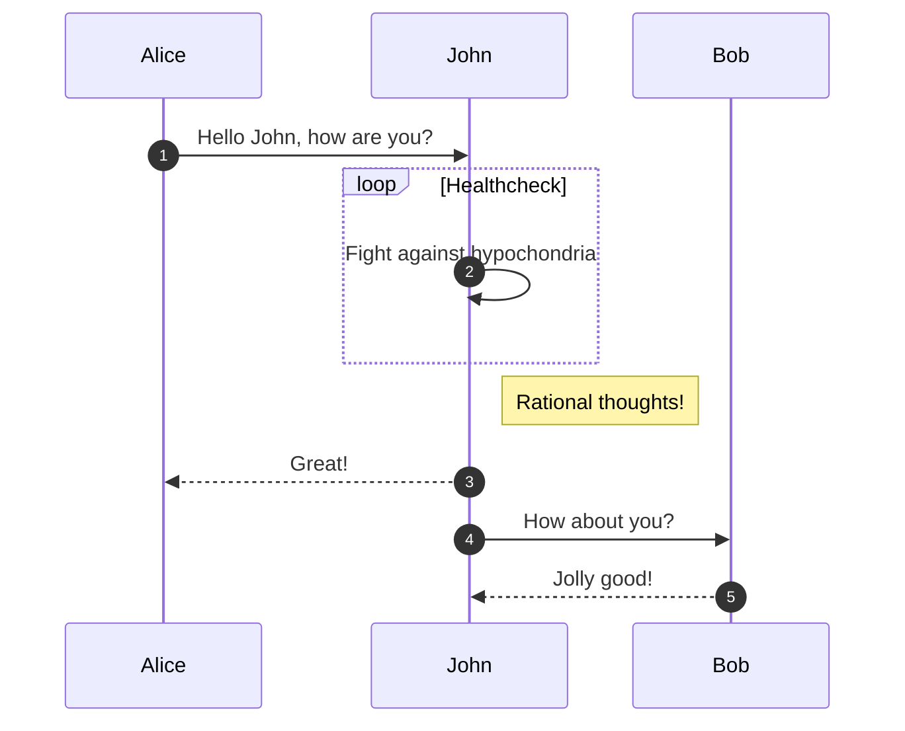
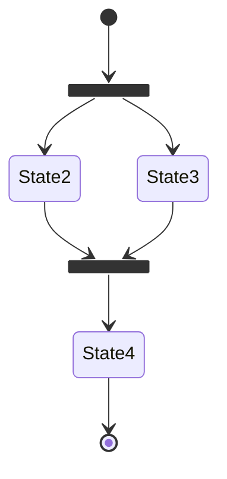
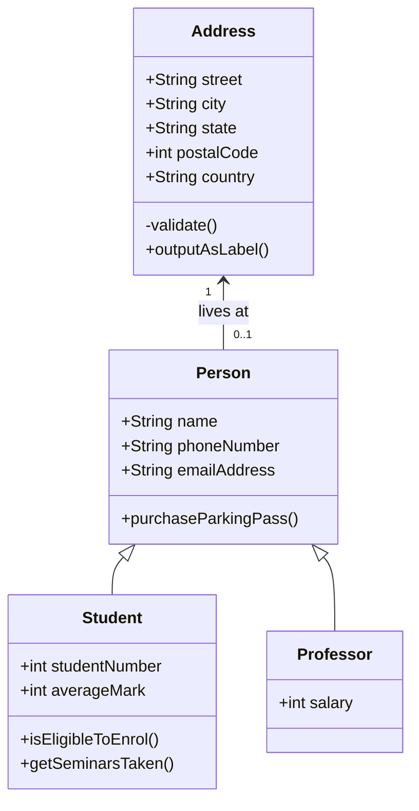
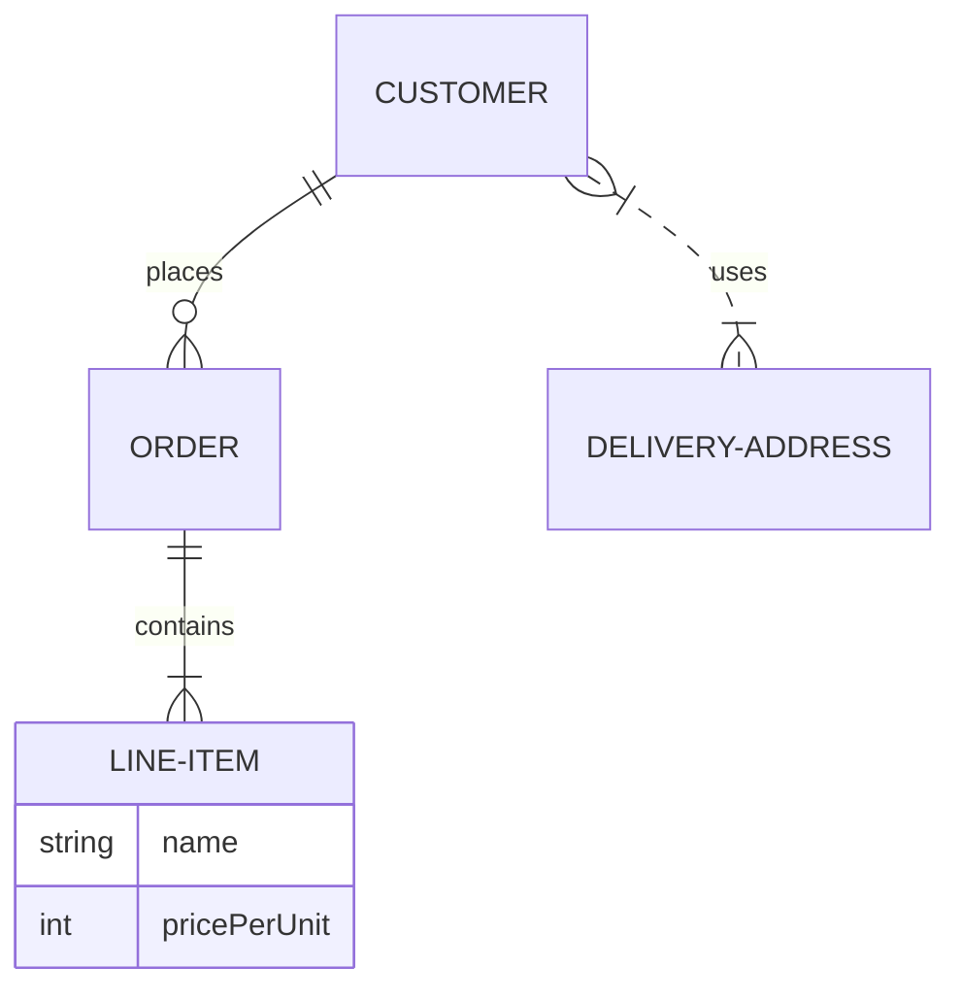

# markdown示例

## 标题(Headings)

```markdown
# 一级标题

## 二级标题

### 三级标题

#### 四级标题

##### 五级标题

###### 六级标题
```

## 文本强调(Emphasis)

**加粗**

*斜体*

***加粗加斜体***

```markdown
**加粗**

*斜体*

***加粗加斜体***
```

## 引用(Blockquotes)

> 多萝西跟着她穿过她的城堡中的许多美丽房间。
>
> 女巫命令她清洗锅碗瓢盆，扫地，还要不断给火炉加木柴。
>
>> 嵌套引用

```markdown
> 多萝西跟着她穿过她的城堡中的许多美丽房间。
>
> 女巫命令她清洗锅碗瓢盆，扫地，还要不断给火炉加木柴。
>
>> 嵌套引用
```

## 列表(Lists)

### 无序列表

- 无序列表1
- 无序列表2
- 无序列表3

```markdown
- 无序列表1
- 无序列表2
- 无序列表3
```

### 有序列表

1. 有序列表1
2. 有序列表2
3. 有序列表3

```markdown
1. 有序列表1
2. 有序列表2
3. 有序列表3
```

### 任务列表

- [x] 任务清单1
- [x] 任务清单2
- [ ] 任务清单3

```markdown
- [x] 任务清单1
- [x] 任务清单2
- [ ] 任务清单3
```

### 定义列表

First Term
: This is the definition of the first term.

Second Term
: This is one definition of the second term.
: This is another definition of the second term.

```markdown
First Term
: This is the definition of the first term.

Second Term
: This is one definition of the second term.
: This is another definition of the second term.
```

## 代码(Code)⭐

### 局部代码块

At the command prompt, type `nano`.

```markdown
At the command prompt, type `nano`.
```

### 局部代码块语法高亮

The `#!python range()` function is used to generate a sequence of numbers.

```markdown
The `#!python range()` function is used to generate a sequence of numbers.
```

### 围栏代码块

``` json
{
  "firstName": "John",
  "lastName": "Smith",
  "age": 25
}
```

### 添加标题

``` python title="bubble_sort.py"
def bubble_sort(items):
    for i in range(len(items)):
        for j in range(len(items) - 1 - i):
            if items[j] > items[j + 1]:
                items[j], items[j + 1] = items[j + 1], items[j]
```

### 添加注解

``` yaml
theme:
  features:
    - content.code.annotate # (1)
```

1. :man_raising_hand: I'm a code annotation! I can contain `code`, __formatted
   text__, images, ... basically anything that can be written in Markdown.

### 指定行高亮

``` py hl_lines="2 3"
def bubble_sort(items):
    for i in range(len(items)):
        for j in range(len(items) - 1 - i):
            if items[j] > items[j + 1]:
                items[j], items[j + 1] = items[j + 1], items[j]
```

### 引入外部文件⭐

``` json title="demo.json"
--8<-- "docs/other/website_building/code/demo.json"
```

## 水平线(Horizontal Rules)

***

---

```markdown
***

---
```

## 链接(Links)

### 基本链接

My favorite search engine is [google](https://www.google.com).

My favorite search engine is [google](https://www.google.com "鼠标悬停提示").

```markdown
My favorite search engine is [google](https://www.google.com).

My favorite search engine is [google](https://www.google.com "鼠标悬停提示").
```

### 直接将url转为链接

<https://www.markdownguide.org>

<fake@example.com>

```markdown
<https://www.markdownguide.org>

<fake@example.com>
```

### 链接格式化

I love supporting the **[EFF](https://eff.org)**.

This is the *[Markdown Guide](https://www.markdownguide.org)*.

See the section on [`code`](#code).

```markdown
I love supporting the **[EFF](https://eff.org)**.

This is the *[Markdown Guide](https://www.markdownguide.org)*.

See the section on [`code`](#code).
```

### 参考链接

In a hole in the ground there lived a hobbit. Not a nasty, dirty, wet hole, filled with the ends
of worms and an oozy smell, nor yet a dry, bare, sandy hole with nothing in it to sit down on or to
eat: it was a [hobbit-hole][1], and that means comfort.

[1]: <https://en.wikipedia.org/wiki/Hobbit#Lifestyle> "Hobbit lifestyles"

```markdown
In a hole in the ground there lived a hobbit. Not a nasty, dirty, wet hole, filled with the ends
of worms and an oozy smell, nor yet a dry, bare, sandy hole with nothing in it to sit down on or to
eat: it was a [hobbit-hole][1], and that means comfort.

[1]: <https://en.wikipedia.org/wiki/Hobbit#Lifestyle> "Hobbit lifestyles"
```

## 图片(Images)

### 基本图片


```markdown

```

### material-带标题的图片

<figure markdown="span">
  
  <figcaption>Image caption</figcaption>
</figure>

```markdown
<figure markdown="span">
  
  <figcaption>Image caption</figcaption>
</figure>
```

## 表格(Tables)

### 简单表格

| First Header | Second Header | Third Header |
|--------------|---------------|--------------|
| Content Cell | Content Cell  | Content Cell |
| Content Cell | Content Cell  | Content Cell |

```markdown
| First Header | Second Header | Third Header |
|--------------|---------------|--------------|
| Content Cell | Content Cell  | Content Cell |
| Content Cell | Content Cell  | Content Cell |
```

### 内容对其(Alignment)

| First Header | Second Header | Third Header |
|:-------------|:-------------:|-------------:|
| 左对齐          |     居中对齐      |          右对齐 |
| x            |       x       |            x |

```markdown
| First Header | Second Header | Third Header |
|:-------------|:-------------:|-------------:|
| 左对齐          |     居中对齐      |          右对齐 |
| x            |       x       |            x |
```

## material-警告(Admonitions)

### mkdocs.yml配置

```yaml
markdown_extensions:
  - admonition
  - pymdownx.details
  - pymdownx.superfences
```

### 基本使用

!!! note

    Lorem ipsum dolor sit amet, consectetur adipiscing elit. Nulla et euismod
    nulla. Curabitur feugiat, tortor non consequat finibus, justo purus auctor
    massa, nec semper lorem quam in massa.

```markdown
!!! note

    Lorem ipsum dolor sit amet, consectetur adipiscing elit. Nulla et euismod
    nulla. Curabitur feugiat, tortor non consequat finibus, justo purus auctor
    massa, nec semper lorem quam in massa.
```

### 自定义标题

!!! note "Phasellus posuere in sem ut cursus"

    Lorem ipsum dolor sit amet, consectetur adipiscing elit. Nulla et euismod
    nulla. Curabitur feugiat, tortor non consequat finibus, justo purus auctor
    massa, nec semper lorem quam in massa.

```markdown
!!! note "Phasellus posuere in sem ut cursus"

    Lorem ipsum dolor sit amet, consectetur adipiscing elit. Nulla et euismod
    nulla. Curabitur feugiat, tortor non consequat finibus, justo purus auctor
    massa, nec semper lorem quam in massa.
```

### 隐藏标题

!!! note ""

    Lorem ipsum dolor sit amet, consectetur adipiscing elit. Nulla et euismod
    nulla. Curabitur feugiat, tortor non consequat finibus, justo purus auctor
    massa, nec semper lorem quam in massa.

```markdown
!!! note ""

    Lorem ipsum dolor sit amet, consectetur adipiscing elit. Nulla et euismod
    nulla. Curabitur feugiat, tortor non consequat finibus, justo purus auctor
    massa, nec semper lorem quam in massa.
```

### 可折叠

??? note

    Lorem ipsum dolor sit amet, consectetur adipiscing elit. Nulla et euismod
    nulla. Curabitur feugiat, tortor non consequat finibus, justo purus auctor
    massa, nec semper lorem quam in massa.

```markdown
??? note

    Lorem ipsum dolor sit amet, consectetur adipiscing elit. Nulla et euismod
    nulla. Curabitur feugiat, tortor non consequat finibus, justo purus auctor
    massa, nec semper lorem quam in massa.
```

### 各种类型

!!! note

!!! abstract

!!! info

!!! tip

!!! success

!!! question

!!! warning

!!! failure

!!! danger

!!! bug

!!! example

!!! quote

## material-注解(Annotations)

### mkdocs.yml配置

```yaml
markdown_extensions:
  - attr_list
  - md_in_html
  - pymdownx.superfences
```

### 注解示例

Lorem ipsum dolor sit amet, (1) consectetur adipiscing elit.
{ .annotate }

1. I'm an annotation!

```markdown
Lorem ipsum dolor sit amet, (1) consectetur adipiscing elit.
{ .annotate }

1. I'm an annotation!
```

## material-按钮(Buttons)

### mkdocs.yml配置

```yaml
markdown_extensions:
  - attr_list
```

### 示例

[Subscribe to our newsletter](#){ .md-button }

[Subscribe to our newsletter](#){ .md-button .md-button--primary }

[Send :fontawesome-solid-paper-plane:](#){ .md-button }

```markdown
[Subscribe to our newsletter](#){ .md-button }

[Subscribe to our newsletter](#){ .md-button .md-button--primary }

[Send :fontawesome-solid-paper-plane:](#){ .md-button }
```

## material-内容选项卡(Content Tabs)

=== "C"

    ``` c
    #include <stdio.h>

    int main(void) {
      printf("Hello world!\n");
      return 0;
    }
    ```

=== "C++"

    ``` c++
    #include <iostream>

    int main(void) {
      std::cout << "Hello world!" << std::endl;
      return 0;
    }
    ```

``` markdown
=== "C"

    ``` c
    #include <stdio.h>

    int main(void) {
      printf("Hello world!\n");
      return 0;
    }
    ```

=== "C++"

    ``` c++
    #include <iostream>

    int main(void) {
      std::cout << "Hello world!" << std::endl;
      return 0;
    }
    ```
```

## material-图表(Diagrams)

### 流程图



```markdown title="mermaid"
graph LR
  A[Start] --> B{Error?};
  B -->|Yes| C[Hmm...];
  C --> D[Debug];
  D --> B;
  B ---->|No| E[Yay!];
```

### 时序图



```markdown
sequenceDiagram
  autonumber
  Alice->>John: Hello John, how are you?
  loop Healthcheck
      John->>John: Fight against hypochondria
  end
  Note right of John: Rational thoughts!
  John-->>Alice: Great!
  John->>Bob: How about you?
  Bob-->>John: Jolly good!
```

### 状态图



```markdown
stateDiagram-v2
  state fork_state <<fork>>
    [*] --> fork_state
    fork_state --> State2
    fork_state --> State3

    state join_state <<join>>
    State2 --> join_state
    State3 --> join_state
    join_state --> State4
    State4 --> [*]
```

### 类图



```markdown
classDiagram
  Person <|-- Student
  Person <|-- Professor
  Person : +String name
  Person : +String phoneNumber
  Person : +String emailAddress
  Person: +purchaseParkingPass()
  Address "1" <-- "0..1" Person:lives at
  class Student{
    +int studentNumber
    +int averageMark
    +isEligibleToEnrol()
    +getSeminarsTaken()
  }
  class Professor{
    +int salary
  }
  class Address{
    +String street
    +String city
    +String state
    +int postalCode
    +String country
    -validate()
    +outputAsLabel()  
  }
```

### 实体关系图



```markdown
erDiagram
  CUSTOMER ||--o{ ORDER : places
  ORDER ||--|{ LINE-ITEM : contains
  LINE-ITEM {
    string name
    int pricePerUnit
  }
  CUSTOMER }|..|{ DELIVERY-ADDRESS : uses
```


