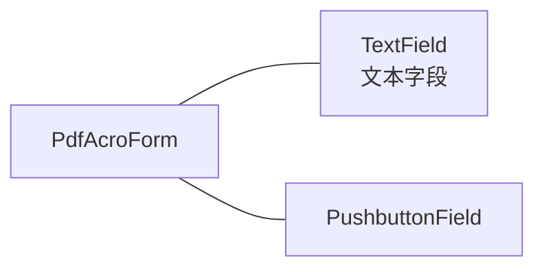

# PDF和数字签名

在本文中，我们将结合国际标准化组织（ISO）的PDF标准`ISO-32000-1`、欧洲电信标准化协会（ETSI）的TS 102 778（即`PAdES`
），以及ISO-32000-1的后继标准`ISO-32000-2`（尚未正式发布）中的规范。

`ISO-32000-1`
中的一些实现将在ISO-32000-2中被弃用。当比较ISO标准与ETSI标准时，可能存在解释的余地，但在这种情况下，我们将选择我们认为最具未来可靠性的选项。请注意，本文介绍的原则是摘要。如需更多详情，请参阅实际的标准。

## PDF中的数字签名

在第1.1节中，我们深入研究了不同的PDF文件。我们看了看数字签署PDF文档所需的基础设施。现在让我们专注于实际的签名部分。

### 签名处理器和子过滤器

创建PDF的数字签名时，您需要定义一个首选的`签名处理器（即/Filter条目）`。在iText中，我们总是使用`/Adobe.PPKLite过滤器`
。虽然可以调整iText以使用其他过滤器，但实际上很少需要这样做：交互式PDF处理器可以使用其首选的任何处理器，只要该处理器支持指定的
`/SubFilter格式`。

`子过滤器`指的是用于创建签名的编码或格式。例如：它是否使用PKCS#1、PKCS#7或CAdES？部分信息（如公共证书）是否存储在签名外部，还是嵌入在签名中？

!!! note

    在PDF中，我们有时会提到`分离的签名`。根据维基百科的定义，分离的签名是一种数字签名类型，与其签名的数据`分开存放`，而不是`打包成单个文件`。然而，在PDF的上下文中，这个定义并不完全正确：签名是包含在PDF文件中的，但签名的属性是`签名的一部分`，而不是`存储在签名字典中`。

在iText 5.3.0之前的版本中，您可以使用setCrypto()方法的以下参数来对PDF文档进行签名：

- `PdfSignatureAppearance.WINCER_SIGNED` — 使用此选项创建的签名使用子过滤器 `/adbe.pkcs7.sha1`。
- `PdfSignatureAppearance.SELF_SIGNED` — 使用此选项创建的签名使用子过滤器 `/adbe.x509.rsa_sha1`。

这些选项在5.3.0版本中被移除，原因非常具体。

`/adbe.pkcs7.sha1`子过滤器将在PDF
2.0中被弃用。ISO-32000-2建议：`为了支持向后兼容性，PDF阅读器应该处理/SubFilter关键字的这个值，但PDF编写器不应再使用该值进行签名。`
iText是一个PDF编写器，自iText 5.3.0起，我们不再允许创建此类类型的签名。请不要再使用这种子过滤器对任何文档进行签名。

至于`/adbe.x509.rsa_sha1`，在PDF 2.0中仍然可用，但其使用的底层标准（`PKCS#1`）在`PAdES12`
中明确禁止使用。换句话说，签名的/Contents条目的值不能是DER编码的PKCS#1二进制数据对象。我们已经停止支持创建`纯粹的PKCS#1签名`
，以确保iText创建的签名符合PAdES标准。

!!! note

    `PKCS#7容器`中的加密摘要以嵌入的`PKCS#1对象`的形式存储。当然，在PAdES标准中这是完全允许的。

从iText
5.3.0版（发布于2012年6月）开始，我们彻底重新设计了数字签名功能。从这个版本开始，默认使用分离的签名，即`/adbe.pkcs7.detached`
或`/ETSI.CAdES.detached`。

!!! note

    还有`/ETSI.RFC3161`，但如果您查阅RFC 3161，您会发现它是一个X509 PKI时间戳协议。

毫无疑问，iText具有足够的灵活性，允许创建使用子过滤器`/adbe.x509.rsa_sha1`或`/adbe.pkcs7.sha1`
的签名，但我们有意增加了相关操作的难度，以阻止它们的使用。在接下来的章节和部分中，除非另有说明，您可以安全地假设我们讨论的是
`分离的签名`。

### 数字签名覆盖的字节范围

图2.1展示了一个签名PDF的示意图。

<figure markdown="span">
  { loading=lazy }
  <figcaption>图2.1：一个签过名的PDF</figcaption>
</figure>

在第1.1.3节中，我们检查了签名PDF的语法，并看到签名字典包含一个`/ByteRange`条目。如果您阅读`ISO-32000-1`
，您会发现这个字节范围可能包含间隙：PDF中未被签名覆盖的区域。理论上，这些间隙可能使PDF变得易受攻击。

PAdES为PDF数字签名规范引入了额外的限制，这已经在`ISO-32000-2`
中考虑到了ETSI子过滤器：`如果/SubFilter为/ETSI.CAdES.detached或/ETSI.RFC3161，则/ByteRange应覆盖整个文件，包括签名字典但不包括/Contents值。`
此外，近期版本的Adobe Acrobat/Reader拒绝具有更多间隙的字节范围的签名。这就是为什么iText始终采用PDF文档的完整字节范围，无论选择了哪种子过滤器。

### 如何生成一个签名

在图2.2的一侧展示了组成签名所需的元素。另一侧展示了实际内容。

<figure markdown="span">
  { loading=lazy }
  <figcaption>图2.2：数字签名的内容</figcaption>
</figure>

在左侧，我们有一个人的数字身份元素：他的私钥和包含他的公钥和身份信息的证书。请注意，大多数情况下，会有一系列的证书链。这将在第3章中详细解释。目前，我们使用的是单个自签名证书。

!!! note

    仔细观察图2.1和图2.2，您会发现整个文档都被数字签名覆盖。不可能仅签署特定页面。一些国家要求每一页都要在签名处签字确认，以使签名有效，以证明每一页都已查看，但PDF中不存在对文档页面进行`签字确认`的概念。

在纯PKCS#1签名中（已不再支持），证书是签名字典中的条目，而不是实际签名的一部分。对于基于CMS和CAdES的签名，`证书`
（或证书链）是嵌入在数字签名中的。签名还包含对使用私钥签署的`原始文档的摘要`。此外，签名还可以包含`时间戳`。

### PDF支持的算法

在1.2.2节中，我们列出了几种用于创建消息摘要的摘要算法，但并非所有我们列出的算法都受PDF支持。在1.3节中，我们讨论了RSA加密算法，但还有其他一些算法可用于签名。

- `数字签名算法（DSA）`——这是用于数字签名的FIPS标准。RSA可以用于加密和签名；DSA主要用于签名。DSA在签名时更快，但在验证时较慢。
- `椭圆曲线数字签名算法（ECDSA）`——这是一个新标准（PKCS #13）。它将在PDF 2.0中引入用于签署PDF文档；iText支持它，但尚未经过测试。在撰写本文时，Adobe
  Reader尚不支持该算法。

让我们来看一下基于子过滤器支持的摘要和加密算法的概述：

!!! note "adbe.pkcs7.sha1(弃用❌)"

    支持的消息摘要：SHA1（可以使用其他摘要算法对已签名数据字段进行摘要，但要求使用SHA1对正在签名的PDF文档数据进行摘要）。

    RSA算法：最高支持1024位（自PDF 1.3起），2048位（自PDF 1.5起），4096位（自PDF 1.7起）。

    DSA算法：最高支持4096位（自PDF 1.6起）。

    请注意，此子过滤器用于签名创建将在PDF 2.0（ISO-32000-2）中被弃用。自iText版本5.3.0起不再支持此功能。

!!! note "adbe.x509.rsa_sha1(弃用❌)"

    支持的消息摘要：SHA1（自PDF 1.3起）、SHA256（自PDF 1.6起）、以及SHA384、SHA512、RIPEMD160（自PDF 1.7起）。

    RSA算法：最高支持1024位（自PDF 1.3起）、2048位（自PDF 1.5起）、4096位（自PDF 1.7起）。

    DSA算法：不支持。

    请注意，尽管名称中提到了SHA1，但支持其他摘要算法。由于PAdES标准禁止纯PKCS#1，因此我们在iText中不再支持此子过滤器（自5.3.0起）。

!!! note "adbe.pkcs7.detached, ETSI.CAdES.detached和ETSI.RFC3161"

    支持的消息摘要：SHA1（自PDF 1.3起）、SHA256（自PDF 1.6起）、以及SHA384、SHA512、RIPEMD160（自PDF 1.7起）。

    RSA算法：最高支持1024位（自PDF 1.3起）、2048位（自PDF 1.5起）、4096位（自PDF 1.7起）。

    DSA算法：最高支持4096位（自PDF 1.6起）。

    ECDSA：椭圆曲线数字签名算法将在PDF 2.0中支持。

    自iText版本5.3.0起，默认完全支持分离签名。

!!! warning "关于哈希算法的警告"

    一些国家正在逐步淘汰使用SHA-1。建议使用更强的哈希算法。

!!! warning "关于加密的警告"

    美国国家标准与技术研究院（NIST）建议自2010年以来，1024位RSA密钥不再安全，并建议转向2048位RSA密钥。其他国家的相关机构，例如德国，也持相同观点。

现在是时候举一个例子，展示如何使用iText对PDF文档进行签名了。

## 数字签名的Hello World

### 向文档添加可见签名

让我们从签名的`Hello World`应用程序开始。我们如何使用iText对文件进行签名，并得到如图2.3所示的结果？

<figure markdown="span">
  { loading=lazy }
  <figcaption>图2.3：一个签名外观</figcaption>
</figure>

``` java title="代码2.1：SignHelloWorld.java"
--8<-- "docs/topics/itext-signatures/src/main/java/com/luguosong/chapter02_pdf_and_digital_signatures/SignHelloWorld.java"
```

请注意，这还远不是‘最终的代码示例’，但这是一个开始。让我们一步步地分析这个示例。

首先，我们创建一个`PdfReader`和一个`PdfSigner`对象。这是在iText中处理现有PDF文档时常用的操作。

我们使用`PdfSigner`类定义签名的外观。我们设置签名的原因和位置。我们还定义了一个签名将被添加的`矩形区域`、`页码`（第1页）以及签名
`字段的名称`（‘sig’）。

此外，我们需要一个`IExternalDigest`接口的实现来创建摘要，以及一个`IExternalSignature`接口的实现来创建签名，这个过程涉及`哈希`
和`加密`。

我们可以通过选择 `BouncyCastleDigest` 类的实例，使用 Bouncy Castle 作为`摘要`的安全提供者。如果您想要另一个提供者，请使用
`ProviderDigest` 类。iText 仅有一个签名过程的实现：`PrivateKeySignature`；当我们在第4章使用智能卡对文档进行签名时，我们将使用另一种实现。
`PrivateKeySignature`
类的构造函数需要一个 PrivateKey 实例、一个摘要算法和一个提供者。例如：在第4章使用 PKCS#11 应用签名时，我们不会使用 Bouncy
Castle 作为提供者。

<figure markdown="span">
  { loading=lazy }
  <figcaption>摘要接口以及实现</figcaption>
</figure>

<figure markdown="span">
  { loading=lazy }
  <figcaption>签名接口以及实现</figcaption>
</figure>

!!! note

    除非另有说明，iText 使用与创建签名时定义的相同摘要算法来生成 PDF 字节的哈希。加密方法（“RSA”、“DSA”或“ECDSA”）和密钥大小将从私钥对象中获得。如果我们使用在 1.3.1 节中创建的密钥库，iText 将使用 2048 位 RSA 加密，因为这些是我们传递给 keytool 工具的参数。

我们正在使用 `signDetached()` 方法，这意味着我们正在创建一个分离的签名，并且可以在 `adbe.pkcs7.detached` 和
`ETSI.CAdES.detached` 之间选择。这是通过一个名为 `CrypoStandard` 的枚举来完成的：使用 `CMS` 或 `CADES`。

!!! warning

    目前，我们在调用 `signDetached()` 方法时传递了许多空对象和一个 0 值。需要理解的是，我们创建的是仅满足数字签名最低要求的已签名 PDF。如果你希望创建符合最佳签名实践的签名，至少需要用实际对象替换其中两个空值。这将在第三章中讨论。

图2.4展示了不同的图标，这些图标指示签名是否有效。正如你所见，这些图标随着Adobe Acrobat或Reader版本的不同而有所变化。

<figure markdown="span">
  { loading=lazy }
  <figcaption>图2.4</figcaption>
</figure>

红色叉号始终表示您的签名已损坏：内容已被更改或损坏，或者其中一个证书无效等。无论如何，您都不应信任该签名。

!!! warning

    对`CAdES`的支持是非常新的。不要指望比Acrobat/Reader X更早的版本能够验证CAdES签名！Acrobat 9只支持PDF 1.7规范中描述的签名，而`CAdES是PDF 2.0中的新功能`。

在图2.3中，我们看到一个黄色三角形，提示消息为`至少一个签名存在问题`。黄色三角形（或在旧版本的Adobe
Reader中显示的问号）表示签名无法验证，因为缺少某些信息。在我们的例子中，Adobe Reader显示：`签名的有效性未知。`
文档的完整性没有问题，因为我们看到`自从应用此签名后，文档没有被修改。` 那么，究竟缺少了什么呢？

在1.3.1节中，我们为Bruno Specimen创建了自己的密钥库。任何人都可以创建这样的密钥库，并假装自己是Bruno Specimen。Adobe
Reader意识到了这个问题，并提示我们：`签名者的身份未知，因为它没有包含在您的受信任身份列表中，并且它的父证书也不是受信任的身份。 `
先忽略关于父证书的第二部分，先来关注受信任身份的列表。

### 管理受信任的身份

有多种方法可以将证书添加到受信任身份的列表中。其中一种方法是查看签名面板，然后点击证书详细信息下的`证书详细信息`
来打开证书查看器。参见图2.5。

<figure markdown="span">
  { loading=lazy }
  <figcaption>图2.5:证书详细信息查看器：添加到受信任的身份</figcaption>
</figure>

有一个名为`信任`的选项卡，上面显示`这是一个自签名证书。所选证书路径有效。` 然而：`该证书不受信任。`
在信任设置中，有一个按钮，标有`添加到受信任的身份`。如果点击该按钮，会出现另一个对话框，如图2.6所示。

<figure markdown="span">
  { loading=lazy }
  <figcaption>警告</figcaption>
</figure>

<figure markdown="span">
  { loading=lazy }
  <figcaption>图2.6：导入联系人设置对话框</figcaption>
</figure>

你可以选择将此证书用作受信任的根证书。让我们尝试一下，看看会发生什么。按照图2.7所示，转到“编辑 > 保护 > 管理受信任的身份...”。

<figure markdown="span">
  { loading=lazy }
  <figcaption>图2.7：导入联系人设置对话框</figcaption>
</figure>

如果你像图2.8所示那样显示证书，你会发现我们的自签名证书被列在其中。

<figure markdown="span">
  { loading=lazy }
  <figcaption>图2.8：管理受信任的身份”对话框</figcaption>
</figure>

从现在开始，您在打开签名文件时会看到一个绿色的勾号。请参见图 2.9。

<figure markdown="span">
  { loading=lazy }
  <figcaption>图2.9：已签署的文档且签名有效。</figcaption>
</figure>

这是一种将证书添加到受信任身份的方法，但这违背了数字签名的目的。如果您仍然接受签署者身份的有效性，那为什么还要经历签名的麻烦呢？我们在讨论认证时最初想到的想法是，Bruno
Specimen会将他的公钥证书发送给您，您可以用它来识别他。因此，让我们将该证书从受信任身份列表中移除，并尝试另一种方法。

### 在Adobe Reader中将证书添加到联系人列表

Bruno Specimen可以使用代码示例2.3中显示的命令，从他的密钥存储中提取他的公钥证书。

```shell title="代码2.3"
$ keytool -export -alias demo -file bruno.crt -keystore ks -storepass password
```

结果是一个文件名，可以通过点击`添加联系人`将其导入到 Adobe Reader 中（参见图 2.8）。只需浏览文件 bruno.crt 并点击`导入`（参见图
2.10）。文件将显示在受信任身份列表中，但不要忘记编辑信任设置！您需要明确信任该证书（如图 2.6 所示），然后才能验证 Bruno
Specimen 的签名。

<figure markdown="span">
  { loading=lazy }
  <figcaption>图2.10：将证书导入受信任身份列表</figcaption>
</figure>

但等等！如果你其实并不认识 Bruno Specimen 呢？如果有人冒充 Bruno Specimen 向你发送了一个公钥怎么办？你怎么能确定向你发送公钥的人就是他或她自称的那个人呢？

有不同的方法和机制可以让你在无需手动管理受信任身份的情况下获得绿色勾号。在第3章中，我们将讨论`证书颁发机构`
，而在第3.4节中，我们会探讨获得绿色勾号的不同选项，这些选项需要较少（甚至无需）手动干预。首先，让我们使用另一种方法创建一个
PdfSigner 对象，再次对我们的 Hello World 文件进行签名。

### 对大型 PDF 文件进行签名

在代码2.1中，iText 会在内存中创建一个你即将签名的文档副本，并将保留用于签名的字节留空。iText
需要这个副本来提供需要`哈希`和`签名`的字节。这对于大文件来说可能会带来问题：你可能会遇到`内存不足异常（OutOfMemoryExceptions）`
。如果你希望将副本存储在磁盘上而不是保存在内存中，请参阅代码示例
2.4。

``` java title="代码2.4"
--8<-- "docs/topics/itext-signatures/src/main/java/com/luguosong/chapter02_pdf_and_digital_signatures/SignHelloWorldWithTempFile.java"
```

与代码示例 2.1 只有一个不同之处，我们在创建`PdfSigner对象`时添加了一个path路径作为额外参数。该路径可以是指向特定文件的路径，也可以是指向目录的路径。如果选择的是目录，iText
将在该目录中创建一个具有唯一名称的文件。

<figure markdown="span">
  { loading=lazy }
  <figcaption>签章过程中会产生临时文件</figcaption>
</figure>

!!! note

    如果你在创建`PdfSigner对象`时使用了一个临时文件，可以将 OutputStream 设置为 null。在这种情况下，临时文件将作为最终的目标文件存储。这种做法是一个好的实践，特别是当你希望将签名后的文件存储在文件系统中时。如果 OutputStream 不是 null，iText 在签名完成后将尝试删除临时文件。

请确保使用具有足够写入权限的路径，并确保在多线程环境中不要尝试覆盖现有文件。由于在这些示例中我们使用的是非常简单的 PDF
文件，我们将继续使用让 iText 将字节保留在内存中的方法。

我们已经看到一个带有`隐形签名`的PDF示例（见图1.3），也已经看到带有`可见签名`
的PDF文档（例如，见图2.3）。在代码示例10和13中，我们使用Rectangle对象以及左下角和右上角的绝对坐标创建了一个可见签名。如果你定义一个矩形，其宽度或高度（或两者）为零，那么你就是在创建一个
`隐形签名`。

当创建一份你知道需要被签署的文档时，你可以提前选择签名矩形的坐标。

## 创建和签署签名域

确定签名应放置的坐标并不总是简单。因此，如果您需要一个可见的签名，您可能想要创建一个占位符。让我们先使用Adobe
Acrobat创建一个带有空白签名域的PDF文档。

### 使用Adobe Acrobat添加签名域

在Adobe Acrobat中打开需要签名的文档，然后在菜单中选择表单 > 添加或编辑字段。现在在`添加新字段`下拉列表框中选择`数字签名`
，并绘制一个矩形。Acrobat会为该字段建议一个`名称`，例如Signature1。如图2.11所示。如果有必要，您可以更改此名称，但对我们来说，这个名称就可以了。

<figure markdown="span">
  { loading=lazy }
  <figcaption>图2.11：使用Adobe Acrobat添加空白签名域</figcaption>
</figure>

让我们保存这个文档，并使用代码示例2.5填写它。

``` java title="代码2.5：签署签名域"
--8<-- "docs/topics/itext-signatures/src/main/java/com/luguosong/chapter02_pdf_and_digital_signatures/SignEmptyField.java"
```

再次，代码示例2.1只有一个不同之处。我们不再需要传递`矩形区域`和`页码`；`字段的名称`就足够了。这样，开发人员就不必担心找到最佳坐标来放置签名。

现在让我们看看是否可以使用 iText 创建一个空的签名域。

### 使用iText程序化创建签名域

如果你知道如何使用 iText 创建`AcroForm字段`，你也就知道如何创建一个空的`签名域`，如图 2.11 所示。如果你对`AcroForm字段`
一无所知，可以查看代码示例 2.6。

``` java title="代码2.6"
--8<-- "docs/topics/itext-signatures/src/main/java/com/luguosong/chapter02_pdf_and_digital_signatures/CreateEmptyField.java"
```

iText 提供了不同的便捷类用于`文本字段（TextField）`、`按钮（PushbuttonField）`、`单选按钮和复选框（RadioCheckField）`
。对于签名，我们使用通用类 `PdfFormField`，并通过`SignatureFormFieldBuilder类`中的`createSignature()`方法
创建`签名域`。我们可以选择一个名称，并在必要时设置其他字段属性。

在基于AcroForm技术的PDF表单中，每个字段(签名域)对应零个、一个或多个`小部件注释`。这些`注释`定义了字段在文档上的视觉外观。

我们通过`小部件注释`的`setHighlightMode()`方法来定义当有人点击字段小部件时的行为。有四种不同类型的行为：

1. HIGHLIGHT_NONE— 无高亮。
2. HIGHLIGHT_INVERT— 反转注释方框的内容。
3. HIGHLIGHT_OUTLINE— 反转注释边框。
4. HIGHLIGHT_PUSH— 显示注释时，仿佛其被压入页面表面。



